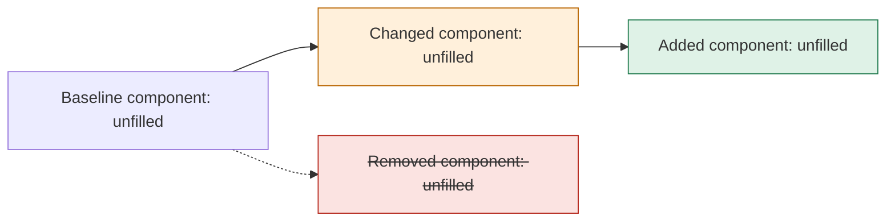
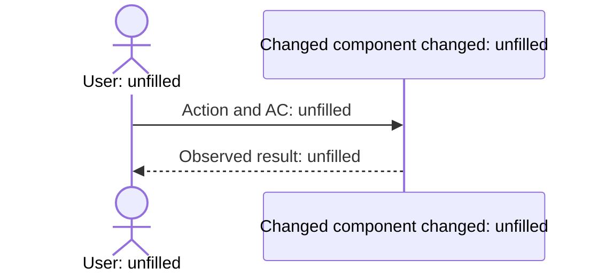
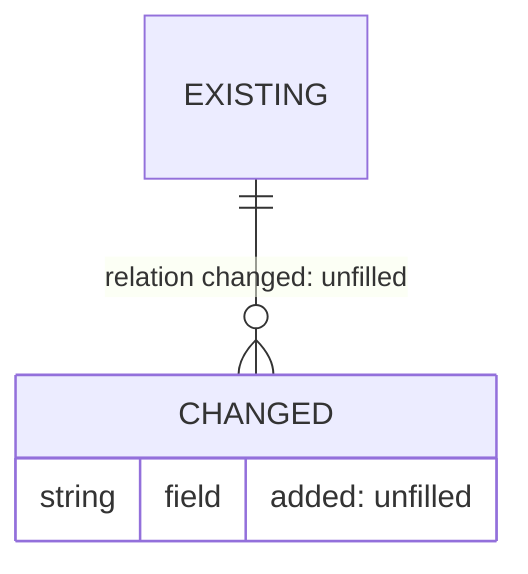
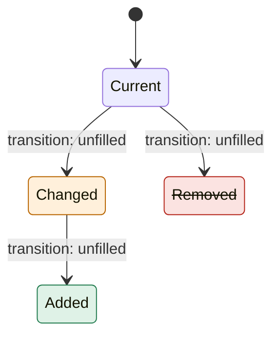
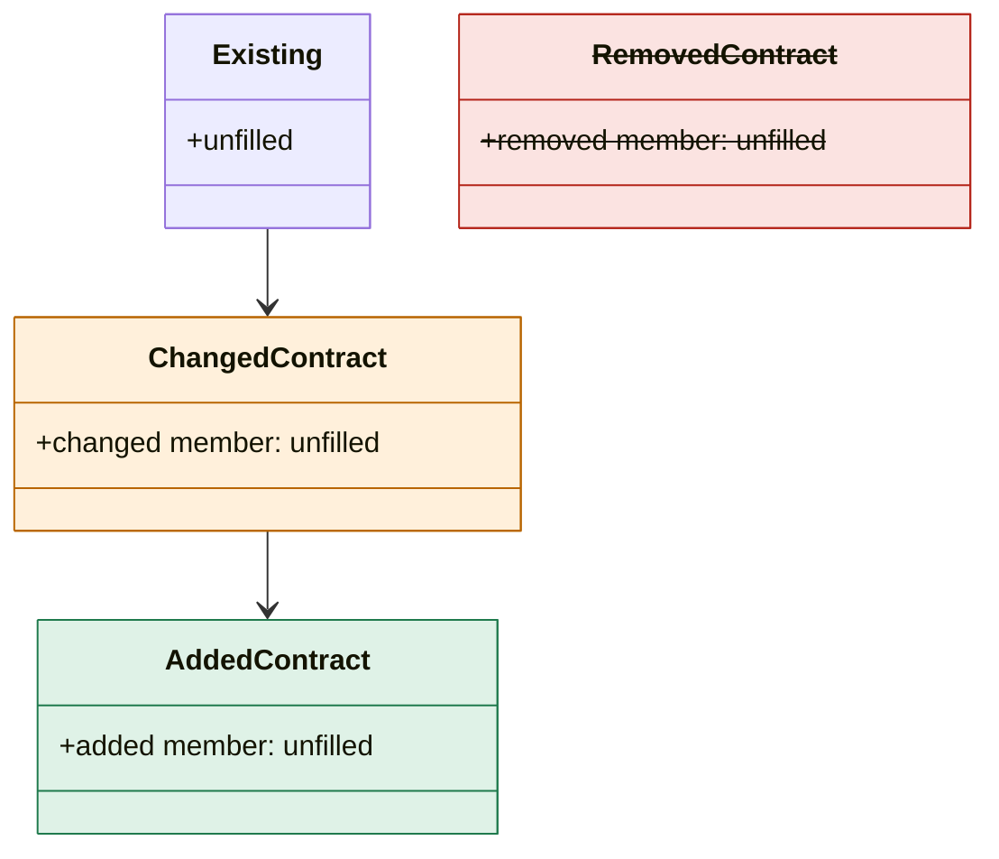

# Design: Unfilled

This is a draft to fill in. Unfilled or undecided entries and diagrams do not establish completion, validation or adoption. Reuse the AC-n / Q-n / D-n and Unit IDs from the Intent's intent.md and decisions.md.

<!-- sec:summary -->
## Summary

Summarize the Intent and Units, why Design is needed (tier H or `required` in the plan), the contracts and diagrams to adopt, and open issues in one screen. Connect that summary to the details below.

| Units | Reason for Design | Design highlights | Open issues and related Q-n |
| --- | --- | --- | --- |
| Unfilled | Unfilled | Unfilled | Unfilled |

Hooks record adoption, bound to the content of design.md, when the person enters `vouch confirm design`. If this document changes after that confirmation, ask the person to confirm again. The model never adopts on their behalf and keeps the status as draft. [R-PROJECT-1]

<!-- sec:ideal -->
## Gap from the ideal outcome

| Ideal outcome and basis | Current behavior and reference | Gap closed in scope | Gap left open, reason and record |
| --- | --- | --- | --- |
| Unfilled | Unfilled | Unfilled | Unfilled |

Show the minimum change that resolves the root cause, without generalizing for the future. Limit compromises to the gaps written here.

<!-- sec:alternatives -->
## Alternatives and trade-offs

| Option | Benefits | Drawbacks | Basis | Adoption and reason |
| --- | --- | --- | --- | --- |
| A: Unfilled | Unfilled | Unfilled | Unfilled | Undecided |
| B: Unfilled | Unfilled | Unfilled | Unfilled | Undecided |

Consider doing nothing and record why when it is not listed. Options that need a human decision become Q-n in decisions.md and are referenced from this table.

<!-- sec:diagrams -->
## Diff diagrams

Show additions, changes and removals against the baseline diagrams in the knowledge layer. Use only the three classDefs added, changed and removed for colour. Where a diagram cannot use classDef, write `added`, `changed` or `removed` after the name.

<!-- diagram:components-diff when:always -->

Connect the changed flow to the ACs.

<!-- diagram:sequence when:always -->

When no schema or data definition changes, record why this diagram does not apply.

<!-- diagram:data-diff when:schema-change -->

When no state or lifecycle changes, record why this diagram does not apply.

<!-- diagram:lifecycle when:lifecycle-change -->

<!-- sec:contract -->
## Contracts

Settle types, schemas, data definitions and interfaces before implementation. Build starts from the contract commit with a passing DoD. [R-PROJECT-5]

| Contract | Diff | Definition location | Check (DoD in rules.md) | Covered ACs and Units |
| --- | --- | --- | --- | --- |
| Unfilled | `added` / `changed` / `removed` | Unfilled | Unconfigured | Unfilled |

When no public API changes, record why this diagram does not apply.

<!-- diagram:contract when:public-api-change -->

<!-- sec:threats -->
## Threat model viewpoints

Fill this in for tiers where quality-layers.json makes the security layer required (tier H). For other tiers, record why it does not apply.

| Viewpoint | Threat considered | Mitigation and contract | Verification method and planned evidence | Remaining risk and decision owner |
| --- | --- | --- | --- | --- |
| Unfilled | Unfilled | Unfilled | Unconfigured | Unfilled |

<!-- sec:units -->
## Design per Unit

| Unit | Risk tier | Design decisions and D-n | Planned contract commits | Non-functional measurement (H) |
| --- | --- | --- | --- | --- |
| Unfilled | Unassessed | Unfilled | Unfilled | Unconfigured |

Distinguish plans from results. Do not record measurements that have not run as evidence. [R-PROJECT-2]

<!-- sec:references -->
## References

Fill in baseline diagram, code and design references as path:line@commit, document#section@date and official URL plus section. Distinguish hypotheses and unexamined areas. Do not report an unfilled draft as ready for adoption. [R-PROJECT-2]
