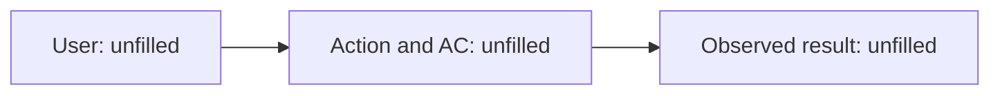
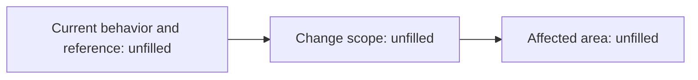

# Intent: Unfilled

This is a draft to fill in. Unfilled or undecided entries and diagrams do not establish completion, validation or approval. Assign AC-n / Q-n / D-n to actual records.

<!-- sec:summary -->
## Summary

Summarize the purpose, Before → After, ACs, non-goals, split and risk, Design needs and open issues in one screen. Connect that summary to the details below.

<!-- sec:acceptance -->
## Acceptance criteria

| ID | Condition and action | Expected result | Success, failure and boundary observations | Unit |
| --- | --- | --- | --- | --- |
| AC-n | Unfilled | Unfilled | Unfilled | Unfilled |

<!-- sec:scope -->
## Ideal outcome and minimum change

| Ideal outcome | Minimum change in scope | Non-goals and remaining gap | Basis for the boundary |
| --- | --- | --- | --- |
| Unfilled | Unfilled | Unfilled | Unfilled |

Record deferred refactoring, its impact and when to reconsider it.

<!-- sec:analysis -->
## Current behavior, root cause and use cases

| Observed fact, reference and revision | Root cause or hypothesis | Affected existing use cases | Unexamined areas |
| --- | --- | --- | --- |
| Unfilled | Unfilled | Unfilled | Unfilled |

Record the knowledge generation and the code revision actually read. Do not claim an explorer run or freshness check that did not happen. [R-PROJECT-2]

<!-- sec:plan -->
## Split, Units, risk and Design

Propose Intent boundaries by behavior and show dependencies. Consider separating preparatory refactoring and contract changes; explain when that split is not adopted. Use the Unit count guideline in intent-authoring.json.

| Unit | Covered ACs | Change scope and dependencies | Risk tier and basis | Design need and reason |
| --- | --- | --- | --- | --- |
| Unfilled | Unfilled | Unfilled | Unassessed | Undecided |

Plan Design for tier H or when required by the plan. Distinguish that plan from an adopted design. Start the risk cell with `L`, `M` or `H` and the Design cell with `required` or `not-required` (approval.json). Tier H is `required`. Approval is not applied while any row stays unassessed or undecided.

<!-- sec:verification -->
## Verification and planned evidence

| AC or DoD | Quality layer and target | Method, command and environment | Pass condition | Evidence location |
| --- | --- | --- | --- | --- |
| AC-n | Unfilled | Unconfigured | Unfilled | Unfilled |
| Dependency audit at every tier | DoD | Refer to rules.md; retain unconfigured entries | Unconfigured | Unfilled |

Use quality-layers.json for required layers and sabotage counts by tier. Distinguish plans from results. Do not fabricate tests, logs, images or commits as evidence. [R-PROJECT-2]

<!-- sec:diagrams -->
## User flow and impact

Replace these slots with actual actions, results and ACs.

<!-- diagram:user-flow when:always -->

For brownfield work, show current references, changes and affected areas. For a new project, record why this diagram does not apply.

<!-- diagram:impact when:brownfield -->

<!-- sec:checkpoints -->
## Checkpoints and adoption boundary

Use the granularity and conditions in workflow.json and rules.md, including Unit confirmations for tier H.

| Checkpoint, target and revision | Proposed understanding | Human words and source | Basis for confirmed or unconfirmed |
| --- | --- | --- | --- |
| Unfilled | Unfilled | Unanswered | Unconfirmed |

Hooks record a confirmation when the person enters `vouch confirm <target>`, and an approval when the person enters `vouch approve <gate ID>` for a `vouch review` gate. The hook changes this draft to approved only when every checkpoint is confirmed. The model never changes it to approved and does not implement a plan that is not approved. [R-PROJECT-1]

<!-- sec:references -->
## References

Fill in code path:line@commit, document#section@date and official URL plus section actually read. Distinguish hypotheses and unexamined areas. Do not report an unfilled draft as ready for review. [R-PROJECT-2]
