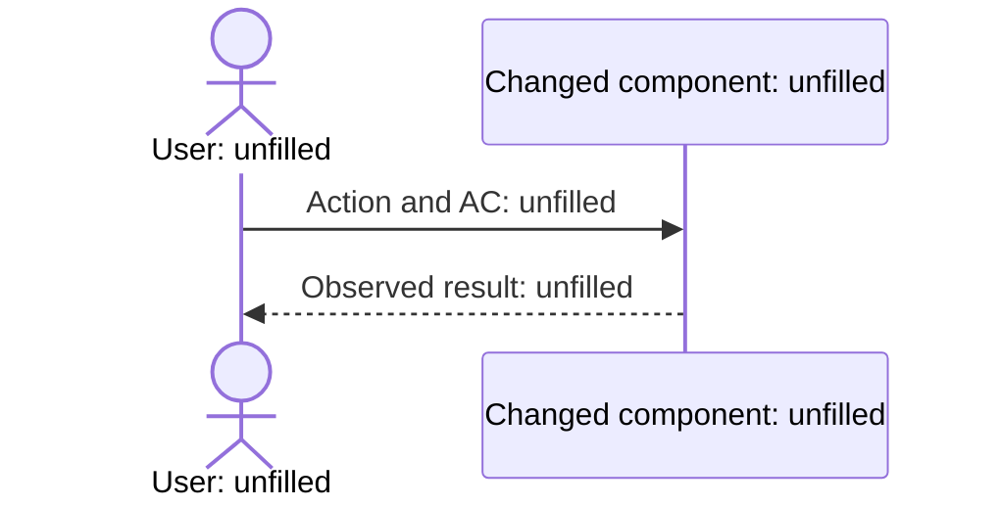

# Review Brief: Unfilled

risk: Unassessed · units: Unfilled · files: Unfilled (counts of `core` / `plumbing` / `tests` / `generated` / `rename`)

This is a Review Brief to fill in, and it becomes the PR description. Unfilled entries do not establish validation or approval. Sections 1 to 4 contain no implementation code; section 4 keeps its Mermaid diagram. People merge the PR at every risk tier. [R-PROJECT-1]

<!-- sec:conclusion -->
## 1. Conclusion

- What changed: Unfilled
- What did not change: Unfilled
- Decisions requested: Unfilled (write "none" if none, and refer to §6)

<!-- sec:behavior -->
## 2. Behavior changes

| AC | Before | After | Supporting test (Given / When / Then) |
| --- | --- | --- | --- |
| AC-n | Unfilled | Unfilled | Unfilled |

<!-- sec:claims -->
## 3. Claims and evidence

Add one row for each layer that quality-layers.json requires for the Intent's risk tier, and add optional layers when the Intent asks for them.

| Quality layer | Claim | Builder evidence | Reviewer reproduction | Agreement or mismatch |
| --- | --- | --- | --- | --- |
| Unfilled | Unfilled | `test:` / `log:` / `shot:` / `commit:` format: unfilled | Not run | Unfilled |

The reviewer does not copy the builder's evidence and cites its own reproduced output. Mismatched rows are where people should look. Do not write claims without evidence. [R-PROJECT-2] [R-PROJECT-5]

<!-- sec:walkthrough -->
## 4. Scenario walkthrough

Connect the changed flow to the ACs.

<!-- diagram:main-flow when:always -->

When no UI changes, record why this does not apply.

<!-- diagram:before-after when:ui-change -->
- Before: `shot:unfilled`
- After: `shot:unfilled`

When no design changes, record why this does not apply.

<!-- diagram:design-diff when:design-change -->
- Diff diagram: `design.md#diagrams` (unfilled)

Demo steps: demo.sh in the Intent folder and the actions people can repeat themselves. Write "not run" if it did not run.

<!-- sec:reading-guide -->
## 5. Reading guide

Classify hunks as `core`, `plumbing`, `tests`, `generated` and `rename`, and state which ones need no reading. Provide a 5-minute version; tier H also has a 15-minute version in which people read the core logic hunks.

| Version | Hunk (path:line) | Category | Read or skip | Reason |
| --- | --- | --- | --- | --- |
| 5 minutes | Unfilled | Unfilled | Unfilled | Unfilled |

<!-- sec:questions -->
## 6. Decisions requested

List deferred decision requests by priority and group dependent ones. Omit questions already answered in the record. The card bodies (situation, options, benefits, drawbacks, basis, recommendation and default) are the Q-n in decisions.md.

<!-- brief:deferred -->
| Priority | Q-n | Topic | Recommendation | Default when unanswered | Blocking and impact |
| --- | --- | --- | --- | --- | --- |
| Unfilled | Q-n | Unfilled | Unfilled | Unfilled | Unfilled |

<!-- sec:references -->
## 7. What I decided, assumptions and references

| D-n | Decided by | Decision and rejected options | Basis |
| --- | --- | --- | --- |
| D-n | Unfilled | Unfilled | Unfilled |

Decision requests that proceeded on the default without an answer. People can overturn them at PR approval; when they do, return the change to the builder and rerun the reviewer. [R-PROJECT-6]

<!-- brief:defaults -->
| Q-n | State | Default applied | Impact | Audit record |
| --- | --- | --- | --- | --- |
| Q-n | Q-n unanswered; default unfilled | Unfilled | Unfilled | Write "not recorded" when absent |

Record knowledge freshness and citation warnings with the IDs and generations of hook.check, hook.denied and knowledge.refreshed in the audit.

References: list the knowledge, code, design and rules relied on as path:line@commit, document#section@date and official URL plus section. Do not report an unfilled Brief as ready for review. [R-PROJECT-2]

<!-- sec:sabotage -->
## 8. Sabotage and shortcut detection

The number of sabotage checks follows sabotage in quality-layers.json. Revert each sabotaged change after its check and never commit it. [R-PROJECT-5]

| Sabotaged location | Expected failing test | Result | Revert confirmed |
| --- | --- | --- | --- |
| Unfilled | Unfilled | Not run | Unfilled |

| Shortcut candidate | Location | Listed in the gap from the ideal outcome | Judgement |
| --- | --- | --- | --- |
| Unfilled | Unfilled | Unfilled | Unfilled |

Findings still open after the round limit (review_rounds in stage-authoring.json).

<!-- brief:unresolved -->
| R-n | Location | Reproduction and observation | Rounds | Builder's position |
| --- | --- | --- | --- | --- |
| Unfilled | Unfilled | Unfilled | 0 | Unfilled |

<!-- sec:limitations -->
## 9. Not done and known limitations

- Not done and non-goals: Unfilled
- Known limitations and unverified areas: Unfilled
- Deferred refactoring and where it is recorded: Unfilled

Learn: proposed additions to rules.md. Append only the proposals people adopt to Corrections in rules.md.

| Lesson or correction | Supporting reference | Rule to add and scope | Human decision |
| --- | --- | --- | --- |
| Unfilled | Unfilled | Unfilled | Unanswered |
