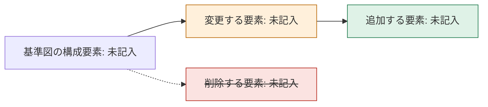
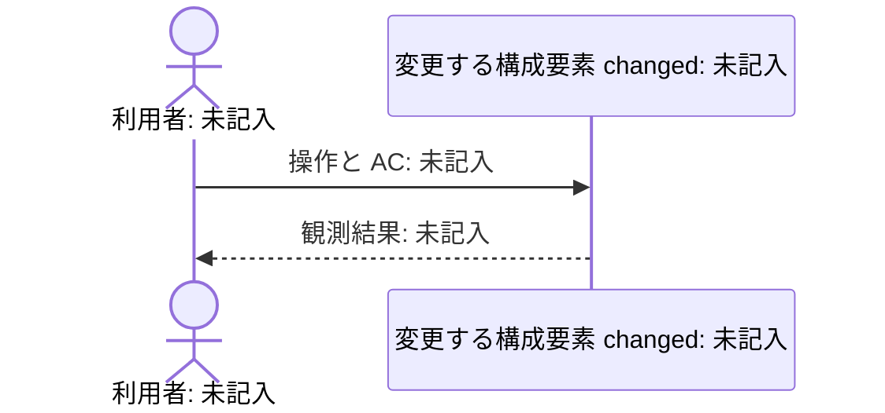
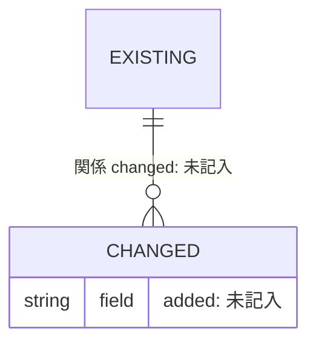
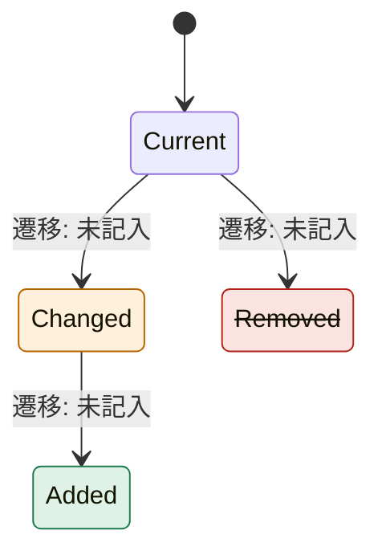
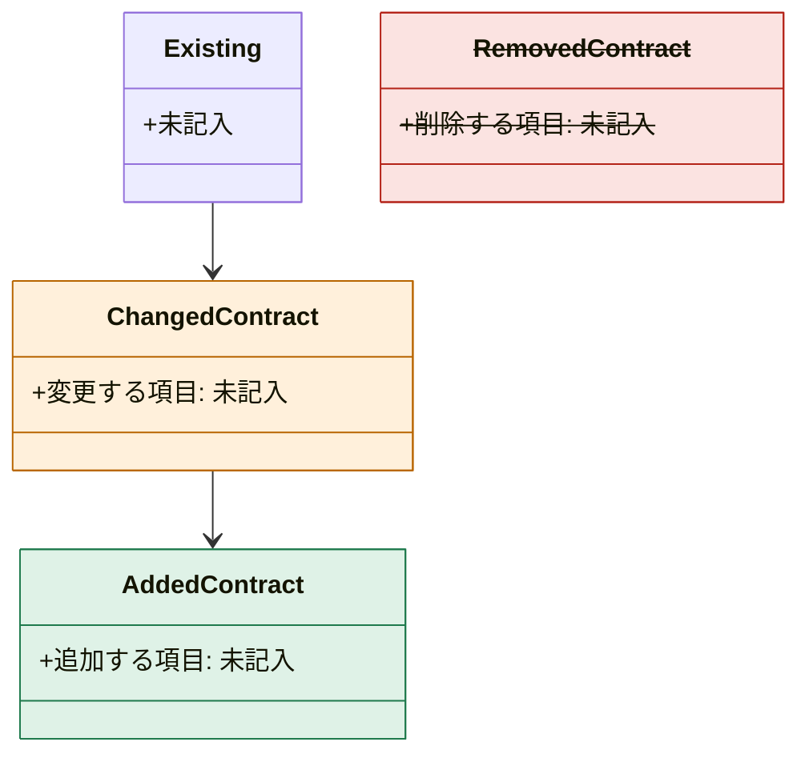

# Design: 未記入

これは記入用の下書き。未記入・未確定の項目と図は、完成・検証・採択を意味しない。対象の Intent の intent.md と decisions.md の AC-n / Q-n / D-n と Unit ID をそのまま使う。

<!-- sec:summary -->
## 要約

対象 Intent と Unit、Design が必要な理由（H、または計画の `required`）、採択する契約と図の要点、未確定事項を1画面にまとめ、以下の詳細へ対応付ける。

| 対象 Unit | Design の理由 | 設計の要点 | 未確定事項と関連 Q-n |
| --- | --- | --- | --- |
| 未記入 | 未記入 | 未記入 | 未記入 |

採択は、人が `vouch confirm design` を入力した時にフックが design.md の内容に結び付けて記録する。確認の後にこの文書を変えたら、人に確認し直してもらう。モデルは採択を代行せず、status を draft のままにする。[R-PROJECT-1]

<!-- sec:ideal -->
## 理想形との差分

| 理想形と根拠 | 現状と参照元 | 今回埋める差分 | 埋めない差分と理由・記録先 |
| --- | --- | --- | --- |
| 未記入 | 未記入 | 未記入 | 未記入 |

根本原因を解決する最小の変更を示し、将来のための汎化をしない。その場しのぎになる箇所は、ここに書いた差分の範囲に限る。

<!-- sec:alternatives -->
## 代替案とトレードオフ

| 案 | 利点 | 欠点 | 根拠 | 採否と理由 |
| --- | --- | --- | --- | --- |
| A: 未記入 | 未記入 | 未記入 | 未記入 | 未決定 |
| B: 未記入 | 未記入 | 未記入 | 未記入 | 未決定 |

「何もしない」も検討し、載せない時は理由を記す。人の判断が要る案は decisions.md の Q-n にし、この表から参照する。

<!-- sec:diagrams -->
## 差分図

基準図（知識レイヤー）に対する追加・変更・削除を示す。色は added・changed・removed の3つの classDef だけを使う。classDef を使えない図は、名前の後に `added` / `changed` / `removed` の語で示す。

<!-- diagram:components-diff when:always -->

変更するフローを AC と結び付ける。

<!-- diagram:sequence when:always -->

スキーマ・データ定義を変えない時は、不適用の理由を残す。

<!-- diagram:data-diff when:schema-change -->

状態・ライフサイクルを変えない時は、不適用の理由を残す。

<!-- diagram:lifecycle when:lifecycle-change -->

<!-- sec:contract -->
## 契約

型・スキーマ・データ定義・インターフェースを実装より先に固める。Build は契約のコミット（DoD 合格）から始める。[R-PROJECT-5]

| 契約 | 差分 | 定義の場所 | 検査（rules.md の DoD） | 対応 AC と Unit |
| --- | --- | --- | --- | --- |
| 未記入 | `added` / `changed` / `removed` | 未記入 | 未設定 | 未記入 |

公開 API を変えない時は、不適用の理由を残す。

<!-- diagram:contract when:public-api-change -->

<!-- sec:threats -->
## 脅威モデル観点表

quality-layers.json で security 層が required の階層（H）で埋める。それ以外の階層は不適用の理由を残す。

| 観点 | 想定する脅威 | 対策と契約 | 検証方法と証拠の予定 | 残るリスクと判断者 |
| --- | --- | --- | --- | --- |
| 未記入 | 未記入 | 未記入 | 未設定 | 未記入 |

<!-- sec:units -->
## Unit ごとの設計

| Unit | リスク階層 | 設計の判断と D-n | 契約コミットの予定 | 非機能の計測（H） |
| --- | --- | --- | --- | --- |
| 未記入 | 未評価 | 未記入 | 未記入 | 未設定 |

予定と実施結果を混同しない。未実行の計測を証拠として書かない。[R-PROJECT-2]

<!-- sec:references -->
## 参照元

記入欄。基準図・コード・設計文書の参照元を、パス:行@コミット、文書#節@日付、公式 URL＋節で列挙する。推測と未確認を区別し、未記入のまま採択可能とは報告しない。[R-PROJECT-2]
