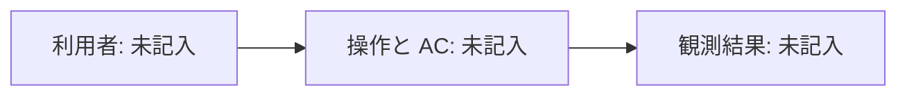
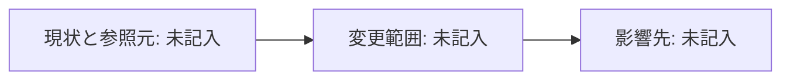

# Intent: 未記入

これは記入用の下書き。未記入・未確定の項目と図は、完成・検証・承認を意味しない。AC-n / Q-n / D-n は実際の記録に合わせて採番する。

<!-- sec:summary -->
## 要約

目的、Before → After、AC、非ゴール、分割とリスク、Design 要否、未確定事項を1画面にまとめ、以下の詳細へ対応付ける。

<!-- sec:acceptance -->
## 受入基準

| ID | 条件・操作 | 期待する結果 | 成功・失敗・境界の観測 | Unit |
| --- | --- | --- | --- | --- |
| AC-n | 未記入 | 未記入 | 未記入 | 未記入 |

<!-- sec:scope -->
## 理想形と最小実装

| 理想形 | 今回の最小実装 | 非ゴール・残る差分 | 線引きの根拠 |
| --- | --- | --- | --- |
| 未記入 | 未記入 | 未記入 | 未記入 |

後回しにするリファクタと、その影響・再検討条件を記す。

<!-- sec:analysis -->
## 現状・根本原因・ユースケース

| 観測した事実と参照元・版 | 根本原因または推測 | 影響する既存ユースケース | 未確認の範囲 |
| --- | --- | --- | --- |
| 未記入 | 未記入 | 未記入 | 未記入 |

知識の世代と実際に読んだコードの版を記す。未実施の explorer・鮮度検査を成功としない。[R-PROJECT-2]

<!-- sec:plan -->
## 分割・Unit・リスク・設計

振る舞い単位の Intent 分割と依存順を示す。準備リファクタと契約変更を分ける案も検討し、採らない時は理由を記す。Unit 数の目安は intent-authoring.json を参照する。

| Unit | 対応 AC | 変更範囲・依存 | リスク階層と根拠 | Design 要否と理由 |
| --- | --- | --- | --- | --- |
| 未記入 | 未記入 | 未記入 | 未評価 | 未確定 |

H または計画が要求する Unit は Design を予定する。設計の採択は未実施と区別する。

<!-- sec:verification -->
## 検証と証拠の予定

| AC または DoD | 品質層・検証対象 | 方法・コマンド・実行場所 | 合格条件 | 証拠の保存先 |
| --- | --- | --- | --- | --- |
| AC-n | 未記入 | 未設定 | 未記入 | 未記入 |
| 全階層の依存監査 | DoD | rules.md を参照。未設定なら未設定 | 未設定 | 未記入 |

quality-layers.json の階層別必須層と破壊検査数を使う。予定と実施結果を混同しない。未実行のテスト・ログ・画像・コミットを証拠として作らない。[R-PROJECT-2]

<!-- sec:diagrams -->
## ユーザー操作と影響範囲

記入枠を実際の操作・結果・AC に置き換える。

<!-- diagram:user-flow when:always -->

brownfield では現状の参照元・変更箇所・影響先を記す。新規なら不適用の理由を残す。

<!-- diagram:impact when:brownfield -->

<!-- sec:checkpoints -->
## 確認点と採択の境界

workflow.json と rules.md の粒度・適用条件を使い、H の Unit 確認も含める。

| 確認点・対象と版 | 提案の要点 | 人の発言と出所 | 未確認・確認済みの根拠 |
| --- | --- | --- | --- |
| 未記入 | 未記入 | 未回答 | 未確認 |

承認の真正性検査は未実装。人の発言は decisions.md に記録できるが、この下書きを approved に変更しない。Build は開始しない。[R-PROJECT-1]

<!-- sec:references -->
## 参照元

記入欄。実際に読んだコードのパス:行@コミット、文書#節@日付、公式 URL＋節を列挙する。推測と未確認を区別し、未記入のままレビュー可能とは報告しない。[R-PROJECT-2]
