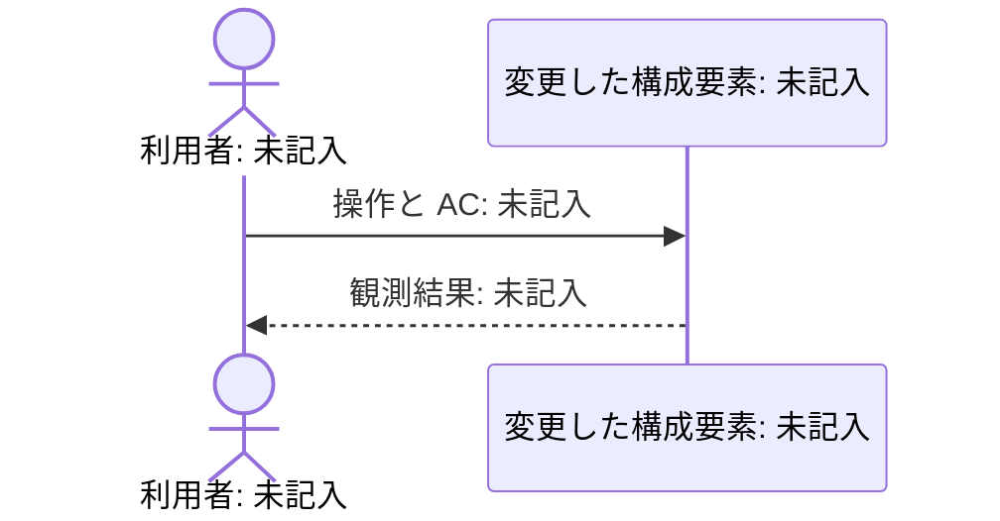

# Review Brief: 未記入

risk: 未評価 · units: 未記入 · files: 未記入（`core` / `plumbing` / `tests` / `generated` / `rename` の数）

これは記入用の Review Brief で、PR の本文になる。未記入の欄は検証・承認を意味しない。1〜4節に実装コードを書かない。4節の Mermaid 図は置く。PR のマージはリスク階層にかかわらず人が行う。[R-PROJECT-1]

<!-- sec:conclusion -->
## 1. 結論

- 何をしたか: 未記入
- 何を変えていないか: 未記入
- 判断してほしいこと: 未記入（なければ「なし」と §6 の参照）

<!-- sec:behavior -->
## 2. 振る舞いの差分

| AC | Before | After | 根拠のテスト（Given / When / Then） |
| --- | --- | --- | --- |
| AC-n | 未記入 | 未記入 | 未記入 |

<!-- sec:claims -->
## 3. 主張と証拠

quality-layers.json で Intent のリスク階層が required とする層を1行ずつ置き、optional の層は Intent が求めた時に置く。

| 品質層 | 主張 | builder の証拠 | reviewer の再現 | 一致・食い違い |
| --- | --- | --- | --- | --- |
| 未記入 | 未記入 | `test:` / `log:` / `shot:` / `commit:` の書式: 未記入 | 未実行 | 未記入 |

reviewer は builder の証拠を引き写さず、自分で再現した出力を証拠にする。食い違う行が人の見るべき箇所である。証拠のない主張を書かない。[R-PROJECT-2] [R-PROJECT-5]

<!-- sec:walkthrough -->
## 4. シナリオ・ウォークスルー

変更したフローを AC と結び付ける。

<!-- diagram:main-flow when:always -->

UI を変えない時は、不適用の理由を残す。

<!-- diagram:before-after when:ui-change -->
- Before: `shot:未記入`
- After: `shot:未記入`

設計を変えない時は、不適用の理由を残す。

<!-- diagram:design-diff when:design-change -->
- 差分図: `design.md#diagrams`（未記入）

デモ手順: Intent フォルダの demo.sh と、人が自分で再現する操作。未実行なら未実行と書く。

<!-- sec:reading-guide -->
## 5. 読むべき箇所ガイド

hunk を `core`・`plumbing`・`tests`・`generated`・`rename` に分け、読まなくてよいものを明示する。5分版を置き、H は15分版も置いて、人がコアロジックの hunk を読む。

| 版 | hunk（パス:行） | 分類 | 読む・読まなくてよい | 理由 |
| --- | --- | --- | --- | --- |
| 5分 | 未記入 | 未記入 | 未記入 | 未記入 |

<!-- sec:questions -->
## 6. 判断してほしいこと

先送りした判断依頼を優先度順に並べ、依存するものはまとめる。記録に答えがあるものは載せない。カード本体（状況・選択肢・メリット・デメリット・根拠・推奨・既定）は decisions.md の Q-n にある。

<!-- brief:deferred -->
| 優先度 | Q-n | 論点 | 推奨 | 未回答時の既定 | ブロックと影響範囲 |
| --- | --- | --- | --- | --- | --- |
| 未記入 | Q-n | 未記入 | 未記入 | 未記入 | 未記入 |

<!-- sec:references -->
## 7. 私が決めたこと・仮定・参照元

| D-n | 判断者 | 判断と採用しなかった案 | 根拠 |
| --- | --- | --- | --- |
| D-n | 未記入 | 未記入 | 未記入 |

未回答のまま既定案で進めた判断依頼。人は PR 承認時に覆せる。覆された時は builder に戻して直し、reviewer をやり直す。[R-PROJECT-6]

<!-- brief:defaults -->
| Q-n | 状態 | 適用した既定 | 影響範囲 | 監査の記録 |
| --- | --- | --- | --- | --- |
| Q-n | Q-n 未回答・既定 未記入 | 未記入 | 未記入 | 未記録なら未記録と書く |

知識の鮮度・引用の警告は、監査の hook.check / hook.denied / knowledge.refreshed の ID と世代つきで記す。

参照元: 根拠にした知識・コード・設計・規約を、パス:行@コミット、文書#節@日付、公式 URL＋節で列挙する。未記入のままレビュー可能とは報告しない。[R-PROJECT-2]

<!-- sec:sabotage -->
## 8. 破壊検査とその場しのぎ検出

破壊検査の数は quality-layers.json の sabotage に従う。壊した変更は検査のたびに元に戻し、コミットしない。[R-PROJECT-5]

| 壊した箇所 | 期待（落ちるテスト） | 結果 | 戻したことの確認 |
| --- | --- | --- | --- |
| 未記入 | 未記入 | 未実行 | 未記入 |

| その場しのぎの候補 | 箇所 | 理想形との差分に書かれているか | 判断 |
| --- | --- | --- | --- |
| 未記入 | 未記入 | 未記入 | 未記入 |

往復の上限（stage-authoring.json の review_rounds）に達しても解消しない指摘。

<!-- brief:unresolved -->
| R-n | 該当箇所 | 再現手順と観測 | 往復 | builder の見解 |
| --- | --- | --- | --- | --- |
| 未記入 | 未記入 | 未記入 | 0 | 未記入 |

<!-- sec:limitations -->
## 9. やっていないこと・既知の制限

- やっていないこと・非ゴール: 未記入
- 既知の制限と未検証の範囲: 未記入
- 後回しにしたリファクタと記録先: 未記入

Learn: rules.md への追記案。人が採用した案だけを rules.md の Corrections に追記する。

| 学び・訂正 | 根拠となる参照元 | 追記する規約と適用範囲 | 人の採否 |
| --- | --- | --- | --- |
| 未記入 | 未記入 | 未記入 | 未回答 |
